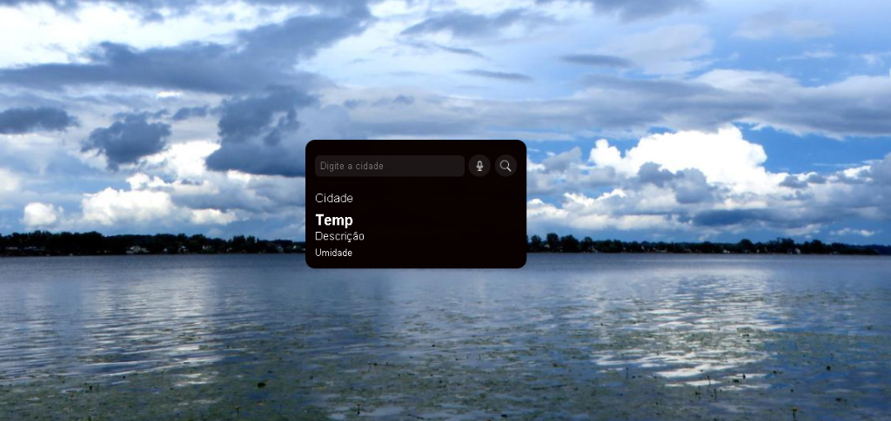

# 🌤️ App Previsão do Tempo com IA

Um aplicativo moderno, totalmente responsivo e interativo para consulta de previsão do tempo, com suporte a comandos de voz e sugestão de roupas inteligente gerada por Inteligência Artificial (IA).

Este projeto foi desenvolvido com base na aula prática e no curso do **DevClub (Rodolfo Mori)**.

---

## 📸 Demonstração do Projeto



---

## 🚀 Funcionalidades
*   **Busca em tempo real:** Mostra temperatura, vento, umidade e sensação térmica de qualquer cidade utilizando a API da [OpenWeatherMap](https://openweathermap.org/).
*   **Comando de voz:** Pesquisa inteligente integrada via reconhecimento de fala nativo do navegador (SpeechRecognition API).
*   **Sugestão de Roupa Inteligente:** Integração com a API do [Groq Cloud](https://groq.com/) para gerar sugestões dinâmicas de roupas baseadas no clima atual da cidade buscada.
*   **Responsividade:** Interface moderna adaptada para celulares, tablets e computadores utilizando Flexbox e CSS Media Queries.
*   **Segurança Avançada (Produção):** Chaves de API ocultadas através de funções de servidor (Vercel Serverless Functions), garantindo que as chaves fiquem seguras quando o projeto estiver online.

## 🛠️ Tecnologias Utilizadas
*   HTML5
*   CSS3 (Flexbox & Media Queries)
*   JavaScript (ES6+, Fetch API, Speech Recognition)
*   Vercel Serverless Functions (Back-end grátis para esconder chaves em produção)

## 🔧 Como rodar o projeto localmente
1. Faça o clone ou baixe este repositório para o seu computador.
2. Na pasta raiz do projeto, copie o arquivo `config.example.js` e renomeie a cópia para `config.js`.
3. Abra o arquivo `config.js` e preencha as suas chaves nos campos correspondentes:
   ```javascript
   const CONFIG = {
       CHAVE_OPEN_WEATHER: "SUA_CHAVE_OPENWEATHER_AQUI",
       CHAVE_GROQ_IA: "SUA_CHAVE_GROQ_AQUI"
   };
